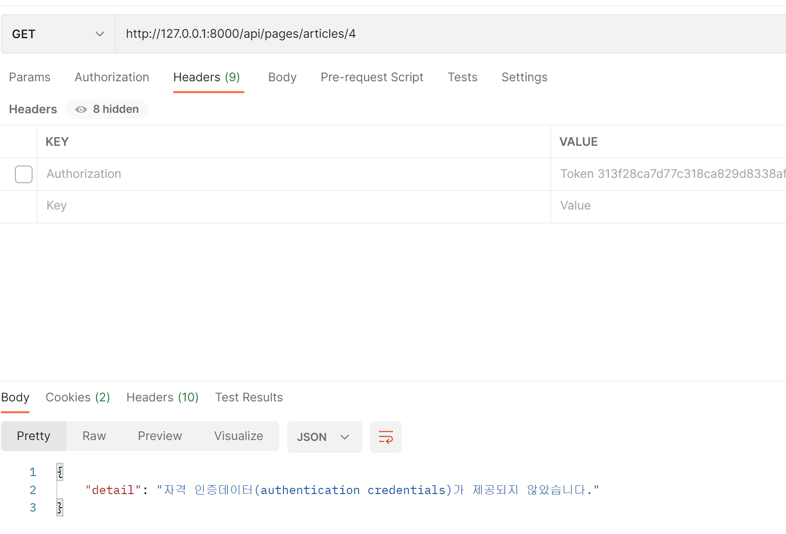

# mini_PJT(Single)

## 1일차

### 오늘의 작업

* 프로젝트 기본 셋팅

  1. 깃 허브 Repository 생성

  2. 장고 기본 셋팅

     ```python
     # TERMINAL
     
     python -m venv venv  # 가상 환경 생성
     source venv/Scripts/activate # 가상 환경 구동
     pip install django==3.2.13 # pip 설치
     pip freeze > requirements.txt # pip 저장
     django-admin startproject MyProject . # 프로젝트 생성
     python manage.py startapp pages # 앱 생성
     ```

  3. MyProject에서의 셋팅

     ```python
     # settings.py
     
     INSTALLED_APPS = [
         # 금방 생성한 앱 추가
         'pages',
         
         'django.contrib.admin',
         'django.contrib.auth',
         'django.contrib.contenttypes',
         'django.contrib.sessions',
         'django.contrib.messages',
         'django.contrib.staticfiles',
     ]
     
     TEMPLATES = [
         {
             'BACKEND': 'django.template.backends.django.DjangoTemplates',
             # 루트 디렉토리 경로 설정
             # 이 경로를 기준으로 프로젝트 내 필요한 파일들을 찾음
             'DIRS': [BASE_DIR / 'templates'],
             
             'APP_DIRS': True,
             'OPTIONS': {
                 'context_processors': [
                     'django.template.context_processors.debug',
                     'django.template.context_processors.request',
                     'django.contrib.auth.context_processors.auth',
                     'django.contrib.messages.context_processors.messages',
                 ],
             },
         },
     ]
     ```

     ```python
     # urls.py
     
     from django.contrib import admin
     
     # include를 활용하여 다른 앱으로 연동이 되도록 하기
     from django.urls import path, include
     
     urlpatterns = [
         path('admin/', admin.site.urls),
         path('pages/', include('pages.urls')),
     ]
     ```

  4. templates 생성

     ```python
     # 공통으로 당겨와서 사용할 html 생성
     # base.html 생성
     
     <!DOCTYPE html>
     <html lang="en">
     <head>
       <meta charset="UTF-8">
       <meta http-equiv="X-UA-Compatible" content="IE=edge">
       <meta name="viewport" content="width=device-width, initial-scale=1.0">
       <title>Document</title>
     </head>
     <body>
     	# 아래 block인 content를 활용하여 내부 요소 넣기
       
       
     </body>
     </html>
     ```

  5. pages에서의 셋팅

     ```python
     # urls.py
     
     from django.urls import path
     from . import views
     
     # 해당 앱에 대한 이름 작성
     app_name = 'pages'
     
     # url 작성
     urlpatterns = [
         path('', views.index, name='index'),           	# pages의 기본 url
         path('create/', views.create, name='create')	# article 생성 url
     ]
     
     ```

     ```python
     # article 의 데이터를 넣을 model 작성하기
     # models.py
     from django.db import models
     
     class Article(models.Model):
         title = models.CharField(max_length=30)
         content = models.TextField()
         created_date = models.DateField(auto_now_add=True) # date 필드 말고 추후 변경 예정일듯?
         
     ```

     ```python
     # 그리고 게시글을 생성하는 view를 작성할 때마다 계속해서 model에 대한 입력 요소를 작성하지 않으며
     # 유효성 검사를 할 수 있도록 modelForm 사용하기 위해 form.py 생성 후 작성
     # forms.py
     
     from django import forms
     # modelForm을 사용하는 것이기에 model 또한 import 해오기
     from .models import Article
     
     class ArticleForm(forms.ModelForm):
         title = forms.CharField(max_length=30)
         content = forms.CharField()
         created_date = forms.DateField()
     
         class Meta:
             model = Article
             fields = '__all__'
     ```

     ```python
     # ulr을 작성했기에 view를 작성하기 위해 이동
     # views.py
     
     from django.shortcuts import render,redirect
     from .forms import ArticleForm
     
     # Create your views here.
     
     # 현재 index는 간단히 페이지가 보이도록만 하였음
     def index(request):
         return render(request, 'pages/index.html')
     
     # create는 요청하는 method가 POST의 경우 요청하는 POST 값을 데이터로 
     # 작성해뒀던 ModelForm에 넣은 후 
     # 해당 form에 대한 유효성 검사를 한 후 
     # 우선은 바로 save 하는 형식으로 했음
     # 여기서 실수했던 부분이 modelForm 으로 작성하지 않고 form으로 작성하다보니
     # 데이터가 save()되지 않았었다는 점.
     # 그리고 이후 post 요청을 완료했기에 redirect로 페이지만 이동하였음
     
     # 우선은 POST 요청이 아닌 경우엔 해당 form 데이터를 넘겨주었음.
     def create(request):
         if request.method == 'POST':
             form = ArticleForm(request.POST)
             if form.is_valid():
                 form.save()
                 return redirect('pages:index')
         else:
             form = ArticleForm()
         context = {
             'form': form
         }
         return render(request, 'pages/create.html', context)
     
     ```

     ```python
     # index.html
     
     
     
     
       <h1>여기는 인덱스 페이지</h1>
     
     
     
     
     # create.html
     
     
     
     
       <h1>여기는 생성 페이지</h1>
     
         # submit 을 통해 form 데이터를 전송할 것이므로
         # method는 POST
         # POST 요청이기에 CSRF token 을 함께 넣어서 전송하며
         # form 태그의 요소들을 모두 p태그로 감싸서 출력
       <form method='POST'>
         
         {{form.as_p}}
         <input type="submit">
       </form>
     
     
     ```


---

## 2일차

### 오늘의 작업

* pages 앱 

  1. models.py 수정

     ```python
     # models.py
     from django.db import models
     
     # 기존의 model에서 해당 게시글을 
     # 임의로 넣으려는 날짜인 write_date 와 update 된 날짜인 updated_date 를 추가 
     class Article(models.Model):
         title = models.CharField(max_length=30)
         content = models.TextField()
         write_date = models.DateField()
         updated_date = models.DateField(auto_now=True)
         created_date = models.DateField(auto_now_add=True) # date 필드 말고 추후 변경 예정일듯?
     ```

  2. form.py 수정

     ```python
     # forms.py
     # content를 작은 크기가 아닌 입력하기 좋은 크기로 받기 위해 widget을 사용
     # widget=forms.Textarea() 추가
     # 또한 기존의 form에서 내가 직접 입력이 필요한 요소만 보이도록 하기
     
     
     from django import forms
     from .models import Article
     
     class ArticleForm(forms.ModelForm):
         title = forms.CharField(max_length=30)
         content = forms.CharField(
             widget=forms.Textarea()
         )
         write_date = forms.DateField(
             widget=forms.DateField()
         )
     
         class Meta:
             model = Article
             fields = '__all__'
     ```


  3. urls.py 수정

     ```python
     # 기존의 데이터에서 detail, update, delete 추가
     # 또한 해당 url들은 어떤 article인지 알아야 하기에 article_pk 값을 받도록 하기
     from django.urls import path
     from . import views
     
     app_name = 'pages'
     
     urlpatterns = [
         path('', views.index, name='index'),
         path('create/', views.create, name='create'),
         path('<int:article_pk>/detail/', views.detail, name='detail'),
         path('<int:article_pk>/update/', views.update, name='update'),
         path("<int:article_pk>/delete/", views.delete, name="delete"),
     ]
     ```

  4. views.py

     ```python
     # 기존의 데이터에서 detail, update, delete 추가
     
     # detail의 경우 어떤 article의 데이터인지 알기 위해 
     # Article 모델에서 obejct.get을 사용하여 해당 article을 가져와서 보이도록 하기
     def detail(request, article_pk):
         article = Article.objects.get(pk=article_pk)
         context = {
             'article': article
         }
         return render(request, 'pages/detail.html', context)
     # update의 경우 마찬가지로 어떤 article의 데이터인지 알기 위해 가져온 뒤
     # POST 요청이 아닌 경우엔 
     # ModelForm에 해당 article 정보를 instance=article 이렇게 데이터를 넣은 뒤 
     # 요청한 사용자에게 데이터를 넣은 form을 보여주고
     # POST 요청의 경우엔
     # ModelForm에 수정한 데이터인 request.POST 데이터를 넣어줌과 동시에 
     # 어떤 article에 대한 데이터인지 뒤에 instance=article 이렇게 데이터를 넣어주기
     def update(request, article_pk):
         article = Article.objects.get(pk=article_pk)
         if request.method == 'POST':
             form = ArticleForm(request.POST,instance=article)
             if form.is_valid():
                 form.save()
                 return redirect('pages:detail', article_pk)
         else:
             form = ArticleForm(instance=article)
         context = {
             'form': form
         }
         return render(request, 'pages/update.html', context)
     
     # delete의 경우 어떤 article인지 가져온 뒤
     # article.delete() 메서드를 이용해서 삭제해주기
     def delete(request,article_pk):
         article = Article.objects.get(pk=article_pk)
         article.delete()
         return redirect('pages:index')
     ```

  5. templates/ html 수정

     ```html
     <!-- index.html -->
     
     
     
       <h1>여기는 인덱스 페이지</h1>
       <a href=""> 생성하기</a>
       <hr>
     
       
         <a href="">
           <p>{{article.title}}</p>
         </a>
         <hr>
       
     
     
     <!-- create.html는 수정 안했음 -->
     
     <!-- detail.html -->
     <!-- 얘는 좀 손게 있어서 따로 상속 받지 않고 사용 -->
     <!DOCTYPE html>
     <html lang="en">
     <head>
       <meta charset="UTF-8">
       <meta http-equiv="X-UA-Compatible" content="IE=edge">
       <meta name="viewport" content="width=device-width, initial-scale=1.0">
       <style>
         body {
           width: 60%;
           padding: 0 20%;
           margin: 0;
         }
         
     
         #article > pre {
           padding: 2rem 0;
           display: flex;
           justify-content: center;
           align-items: center;
           background-color: black;
           color: white;
         }
     
         #title {
           margin-left: 10px;
           font-size: 2rem;
           font-weight: 900;
         }
     
         #date {
           font-size: 0.7rem;
         }
     
         section + article {
           margin-top: 5rem;
           background-color: bisque;
         }
     
         a {
           text-decoration: none;
           color: cadetblue;
           font-weight: 400;
         }
     
         a:hover {
           color: darkolivegreen;
         }
       </style>
       <title>Document</title>
     </head>
     <body >
       <section>
         <h1>✔</h1>
       </section>
       <article>
         <div id="article">
           <div id="title">{{article.title}}</div>
           <span id="date">{{article.write_date}}</span>
           <pre>{{article.content}}</pre>
           <a href="">게시글 수정 / </a>
           <a href="">게시글 삭제</a>
         </div>
       </article>
     
       
     
       <a href="">메인페이지</a>
     </body>
     </html>
     
     <!-- update.html -->
     
     
     
       <h1>수정 페이지</h1>
       <form method="POST">
         
         {{form.as_p}}
         <input type="submit" value="수정">
       </form>
     
     ```

     

---

## 3일차

### 오늘의 작업

* pages 앱 

  1. forms.py 수정

     * forms의 Field들에 대한 스타일을 계속해서 추가하고자 SSAFY에서 배운대로 해보려 했지만
        widge=forms.Textarea() 말고 CharField()에는 attrs 속성이 나오지 않아서(물론 배웠는데 내가 놓쳤거나...)
        계속해서 방법을 찾다가 알아낸것으로 해결
        변수.widget.attrs.update({}) 이렇게 추가해주었다.

       ```python
       from django import forms
       from .models import Article
       
       class ArticleForm(forms.ModelForm):
           title = forms.CharField(max_length=30)
           content = forms.CharField(widget=forms.Textarea())
           write_date = forms.DateField()
       
           title.widget.attrs.update({'style': 'width:51.7rem; background-color :#C0DEFF; border:none; border-radius:2px'})
           content.widget.attrs.update({'style': 'width: 50rem; height: 30rem; background-color :#C0DEFF; border:none; border-radius:4px'})
           class Meta:
               model = Article
               fields = '__all__'
               
       ```

  2. views.py 수정

     * Allowed HTTP methods 추가하기
        django.views.decorators.http의 데코레이터를 사용해서 요청 메서드를 기반으로 접근을 제한하기
        일치하지 않는 메서드 요청의 경우 405 Method Not Allowed를 반환

     * 메서드 목록

       1. require_http_methods()
       2. require_POST()
       3. require_safe()

       ```python
       from django.shortcuts import render,redirect
       from django.views.decorators.http import require_http_methods,require_safe,require_POST
       from .forms import ArticleForm
       from .models import Article
       
       # Create your views here.
       
       @require_safe
       def index(request):
          
       
       @require_http_methods(['GET','POST'])
       def create(request):
          
       
       @require_safe
       def detail(request, article_pk):
          
       
       @require_http_methods(['GET','POST'])
       def update(request, article_pk):
          
       
       @require_POST
       def delete(request,article_pk):
          
       ```

       

* accounts 앱

  1. 앱 생성
      여기서 앱 이름을 accounts 라고 하는 이유는 
      auth와 관련한 경로나 키워드들을 Django 내부적으로 accounts라는 이름으로 사용하고 있기 때문에 되도록 accounts로 지정하는 것을 권장한다고 한다.
      나중에 추가 설정해야 할 일들이 생기지 않도록 하기 위함!

     ```python
     # terminal
     
     python manage.py startapp accounts
     ```

  2. settings.py 수정

     1. AUTH_USER_MODEL 

     ```python
     #settings.py
     
     AUTH_USER_MODEL = 'accounts.User'
     ```

  3. models.py 수정

     1. User 클래스 재정의
        * AbstractUser: 
           관리자 권한과 함께 완전한 기능을 가지고 있는 User model을 구현하는 추상 기본 클래스
        * AbstractUser base classes (추상 기본 클래스):
          * 몇 가지 공통 정보를 여러 다른 모델에 넣을 때 사용하는 클래스
          * 데이터베이스 테이블을 만드는 데 사용되지 않으며,
            대신 다른 모델의 기본 클래스로 사용되는 경우 해당 필드가 하위 클래스의 필드에 추가 됨

     ```python
     from django.db import models
     from django.contrib.auth.models import AbstractUser
     
     # Create your models here.
     
     # AbstractUser를 상속받는 커스텀 User 클래스 작성
     # 기존의 User클래스도 AbstractUser를 상속받기 때문에 
     # 커스텀 User 클래스도 완전히 같은 모습을 가지게 됨
     
     class User(AbstractUser):
         pass
     ```

  4. admin.py

     1. admin site 에 출력되도록 해주기
        기본 User 모델이 아닌 커스텀 User 모델이기 때문에 
        등록하지 않으면 admin site에 출력되지 않는다고 한다.

     ```python
     from django.contrib import admin
     # 추가
     from django.contrib.auth.admin import UserAdmin
     from .models import User
     
     # Register your models here.
     
     admin.site.register(User, UserAdmin)
     ```

  ***여기서 의문점:***

  반드시 User 모델을 대체해야 할까??

  * Django는 새 프로젝트를 시작하는 경우 
     비록 User 모델이 충분 하더라도 커스텀 User 모델을 설정하는 것을 강력하게 권장한다고 한다.
  * 커스텀 User 모델은 기본 User 모델과 동일하게 작동 하면서도 필요한 경우 나중에 맞춤 설정할 수 있기 때문이다.
    * 단, User 모델 대체 작업은 프로젝트의 모든 migrations 혹은 첫 migrate를 실행하기 전에 이 작업을 마쳐야 한다.

  

  

  5. 여기서 dj-rest-auth 사용해보기

     ---------------------------------------------여기부터 우선 생략해보기---------------------------------------------------------------

      왜냐하면 이것 사용해도 다양한 url들이 자동으로 생성 되기 때문

     1. 로그인
     2. 로그아웃
     3. 상세 유저 정보
     4. 비밀번호 변경 등

      우선 DRF 공식문서에서 제안하는 인증 절차 방법을 따르도록 해보기

     

     그래서 인증 여부를 확인하는 방법으로 settings.py에 작성해어야 할 설정으로는 

     * 기본적인 인증 절차를 어떠한 방식으로 둘 것이냐를 설정하는 것
     * 예시의 두가지 방법 외에도 각 framwork마다 다양한 인증 방식이 있다.

      우리가 사용할 방법은 DRF가 기본적으로 제공해주는 인증 방식 중 하나인 `TokenAuthentication` 방법
      물론 위의 방법은 모든 상황에 대한 인증 방식을 정의하는 것이므로, 
      각 요청에 따라 다른 인증 방식을 거치고자 한다면 다른 방식이 필요하다.

     

     

     다양한 인증 방식

     

     

     
     TokenAuthentication 사용 방법

     * INSTALLED_APPS에 rest_framwork.authtoken 등록

     ```python 
     # settings.py
     
     INSTALLED_APPS = [
         ...
         'rest_framework.authtoken'
     ]
     
     ```

     * 각 User 마다 고유 Token 생성

     ```python
     # 이거 사실 어디 작성하는지 모르겠음...
     from rest_framwork.authtoken.models import Token
     
     token = Token.objects.create(user=...)
     print(token.key)
     ```

     * 생성한 Token을 각 User에게 발급
       * User는 발급 받은 Token을 요청과 함께 전송
       * Token을 통해 User 인증 및 권한 확인
     * Token 발급 방법

     ```python
     def some_view_func(request):
         token = Token.objects.create(user=...)
         return Response({'token': token.key})
     ```

     * User는 발급 받은 Token을 headers에 담아 요청과 함께 전송

       * 단, 반드시 Token 문자열 함께 삽입
         * 삽입해야할 문자열은 각 인증 방식마다 다름.
       * 주의 할 것으로 Token 문자열과 발급받은 실제 token 사이를 ' '(공백)으로 구분

     * Authorization HTTP headers 작성 방법

       ```python
       Authorization: Token Token번호
       ```

       

     ---------------------------------------------여기부터 우선 생략해보기---------------------------------------------------------------
     여기부터 Dj-Rest-Auth

     * 회원가입, 이증(소셜 미디어 인증 포함), 비밀번호 재설정, 사용자 세부 정보 검색, 회원 정보 수정 등을 위한
       REST API end point  제공
     * 주의) django-rest-auth 는 제공을 하지 않기에
                 dj-rest-auth 를 사용한다는 점.

     

     ##### dj-rest-auth 사용 방법

     1. 패키지 설치

        ```python
        # console
        pip install dj-rest-auth
        ```

     2. App 등록

        ```python
        # settings.py
        INSTALLED_APPS = (
        	'...',
            'rest_framwork',
            'rest_framwork.authtoken',
            '...',
            'dj_rest_auth',
        )
        ```

     3. migrate 하기

     4. url 등록

        ```python
        #urls.py
        urlpatterns = [
            path('dj-rest-auth/', include('dj_rest_auth.urls'))
        ]
        ```

        

     

     여기서 회원가입이 빠져있기에 회원가입을 하기 위해선 Registration 기능이 필요하다.

     그래서 dj-rest-auth의 회원가입 기능을 사용하기 위해서는 django-allauth 가 필요하다

     

     ##### Registration

     1. django-allauth 설치

     ```python
     # console
     # 반드시 ''도 함께 입력
     pip install 'dj-rest-auth[with_social]'
     ```

     2. settings.py 등록
        * 여기서 SITE_ID를 작성하는 이유
        * Django는 하나의 컨텐츠를 기반으로 여러 도메인에 컨텐츠를 게시 가능하도록 설계가 되어있다.
        * 다수의 도메인이 하나의 데이터베이스에 등록
        * 현재 프로젝트가 첫번째 사이트임을 나타낸다.

     ```python
     # settings.py
     
     INSTALLED_APPS = [
         ...
         # registraion
         'django.contrib.sites',
         'allauth',
         'allauth.account',
         'allauth.socialaccount',
         'dj_rest_auth.registration',
     ]
     
     SITE_ID = 1
     ```

     3. urls.py 등록

     ```python
     # project/urls.py
     urlpatterns = [
         ...
         path('accounts/signup/', include('dj_rest_auth.registration.urls')),
     ]
     ```

     4. migrate
        * allauth 추가에 대한 migrate

     회원가입이기에 GET method는 접근이 불가하고
     회원가입 POST 요청 양식을 제공하며 email은 생략이 가능하다.

     


     Username과 Password를 입력한 후 POST 요청시
    
     


​     

~~~html
  이후 Password change 를 postman으로 입력을 한다면

 

 실패하게 되는데 이유는 
 인증 방법이 입증되지 않아서라고 한다. 
 그래서 settings.py 수정하기

 ```python
 # settings.py
 
 REST_FRAMEWORK = {
     # Authentication
     'DEFAULT_AUTHENTICATION_CLASSES': [
         'rest_framework.authentication.TokenAuthentication',
     ]
 }
 ```

 

 
~~~

---

## 4일차

### 오늘의 작업

* ModelSerializer

  * 우선 Serializer 이란?

    * querysets 및 모델 인스턴스와 같은 복잡한 데이터를
      JSON, XML 또는 기타 컨텐트 유형으로 쉽게 렌더링 할 수 있는
       네이티브 python 데이터 유형으로 변환해준다.
    * 또한 serializer는 deserialization을 제공하여 
      들어오는 데이터의 유효성을 먼저 확인한 후에 
      구문 분석 된 데이터를 복합 형식으로 다시 변환 할 수 있다.

  * ModelSerializer과 Serializer 차이점

    * 장고 모델에 따라 자동으로 필드 세트를 생성
    * serializer에 대한 unique_together 유효성 검사기 자동 생성
    * .create(), .update() 도 default로 포함

  * 그리고 ModelSerializer 에서 추가적인 점

    * class Meta에 fields 가 아닌 exclude=() 를 작성하여 
       serializer에서 제외할 필드 목록을 기입할 수 있다.

    https://ctsictai.medium.com/drf-modelserializer-ffc267705d1e

* rest_framework

  * 설치 순서
    1. 우선 가상환경 실행을 꼭 먼저 해줘야 함
    2. $ pip install djangorestframework
    3. settings.py에서 INSTALLED_APPS에 'rest_framework' 등록

  

* Build RESTful API - Pages

  * GET - List

    * 게시글 데이터 목록 조회하기

    * DRF에서 api_view 데코레이터 작성은 필수라고 한다.

      ```python
      # pages/urls.py
      
      urlpatterns = [
          path('pages/', view.pages_list)
      ]
      ```

      ```python
      # pages/views.py
      from rest_framework.response import Response
      from rest_framework.decorators import api_view
      from .models import Article
      from .serializer import ArticleSerializer
      
      @api_view(['GET'])
      def article_list(request):
          articles = Article.objects.all()
          # many=True 는 다수의 article이 있을 수 있기 때문
          serializer = ArticleSerializer(articles, many=True)
      	# render가 아닌 Response를 사용하여 
      	# JSON 데이터를 DRF 전용 템플릿으로 응답
          return Response(serializer.data)
      ```

      

    * api_view decorator

      * DRF view 함수가 응답해야 하는 HTTP 메서드 목록을 받는다.
      * 기본적으로 GET 메서드만 허용되며 다른 메서드 요청에 대해서는
         405 Method Not Allowed로 응답한다.

    

  * GET - Detail

    * 단일 게시글 데이터 조회

    * 각 데이터의 상세 정보를 제공하는 ArticleSerializer 정의

      ```python
      # pages/urls.py
      
      path('articles/<int:article_pk>/', views.article_detail)
      ```

      ```python
      # pages/views.py
      
      @api_view(['GET'])
      def article_detail(request,article_pk):
          article = Article.objects.get(pk=article_pk)
          serializer = ArticleSerializer(article)
          return Response(serializer.data)
      ```

    

  * POST

    * 게시글 데이터 생성하기

    * 요청에 대한 데이터 생성이 성공했을 경우에는 201 Created 상태 코드
       응답에 실패 했을 경우는 400 Bad reqeust를 응답

      ```python
      # pages/views.py
      
      @api_view(['GET','POST'])
      def article_list(request):
          if request.method == "GET":
              articles = Article.objects.all()
              # many=True 를 작성하는 이유는 여러개의 경우기 때문
              serializer = ArticleSerializer(articles, many=True)
              # render가 아닌 Response를 사용하여 
              # JSON 데이터를 DRF 전용 템플릿으로 응답
              return Response(serializer.data)
          elif request.method == "POST":
              serializer = ArticleSerializer(data=request.data)
              if serializer.is_valid():
                  serializer.save()
                  return Response(serializer.data, status=status.HTTP_201_CREATED)
              return Response(serializer.errors, status=status.HTTP_400_BAD_REQUEST)
      
      ```

  * Raising an exception on invalid data

    * 유효하지 않은 데이터에 대해 예외 발생시키기

    * is_valid()는 유효성 검사 오류가 있는 경우 ValidationError 예외를 발생시키는
       선택적 raise_exception 인자를 사용할 수 있다.

    * DRF에서 제공하는 기본 예외 처리기에 의해 자동으로 처리되며
       기본적으로 HTTP 400 응답을 반환

      ```python
      @api_view(['GET','POST'])
      def article_list(request):
          if request.method == "GET":
              articles = Article.objects.all()
              # many=True 를 작성하는 이유는 여러개의 경우기 때문
              serializer = ArticleSerializer(articles, many=True)
              # render가 아닌 Response를 사용하여 
              # JSON 데이터를 DRF 전용 템플릿으로 응답
              return Response(serializer.data)
          elif request.method == "POST":
              serializer = ArticleSerializer(data=request.data)
              if serializer.is_valid(raise_exception=True):
                  serializer.save()
                  return Response(serializer.data, status=status.HTTP_201_CREATED)
              
      ```

    

  * DELETE

    * 게시글 데이터 삭제하기

    * 요청에 대한 데이터 삭제가 성공했을 경우는 204 No Content 상태 코드 응답
       ( 명령을 수행했고 더 이상 제공할 정보가 없는 경우 )

      ```python
      @api_view(['GET','DELETE'])
      def article_detail(request,article_pk):
          article = Article.objects.get(pk=article_pk)
          if request.method == "GET":
              serializer = ArticleSerializer(article)
              return Response(serializer.data)
          elif request.method == 'DELETE':
              article.delete()
              return Response(status=status.HTTP_204_NO_CONTENT)
      ```

    

  * PUT

    * 게시글 데이터 수정하기

    * 요청에 대한 데이터 수정이 성공했을 경우는 200 OK 상태 코드 응답

      ```python
      @api_view(['GET','DELETE', 'PUT'])
      def article_detail(request,article_pk):
          article = Article.objects.get(pk=article_pk)
          if request.method == "GET":
              serializer = ArticleSerializer(article)
              return Response(serializer.data)
          elif request.method == 'DELETE':
              article.delete()
              return Response(status=status.HTTP_204_NO_CONTENT)
          elif request.method == "PUT":
              serializer = ArticleSerializer(article, data=request.data)
              if serializer.is_valid(raise_exception=True):
                  serializer.save()
                  return Response(serializer.data)
      ```

      110p 1017

  

* Permission settings 

  * Permission(권한)이란 
     사용자의 개인정보 보호를 위해 사요되며 그 권한에 따라 시스템이 자동으로 
     부여하기도 하고 사용자에게 요청을 승인받아야 한다.

  * 권한 세부 설정

    1. 모든 요청에 대해 인증을 요구 하는 설정
    2. 모든 요청에 대해 인증이 없어도 허용하는 설정

  * 우선 모든 요청에 대해 허용 설정

    ```python
    'DERAULT_PERMISSION_CLASSES': [
        'rest_framework.permissions.AllowAny'
    ]
    ```

  * 게시글 조회 및 생성 요청시 인증된 경우만 허용하도록 권한 부여하기 위해 decorator를 활용

     ```python
     # pages/views.py
     # Permission
     from rest_framework.decorators import permission_classes
     from rest_framework.permissions import IsAuthenticated
     
     
     @api_view(['GET','POST'])
     @permission_classes([IsAuthenticated])
     def article_list(request):
         if request.method == "GET":
             articles = Article.objects.all()
             # many=True 를 작성하는 이유는 여러개의 경우기 때문
             serializer = ArticleSerializer(articles, many=True)
             # render가 아닌 Response를 사용하여 
             # JSON 데이터를 DRF 전용 템플릿으로 응답
             return Response(serializer.data)
         elif request.method == "POST":
             serializer = ArticleSerializer(data=request.data)
             if serializer.is_valid(raise_exception=True):
                 serializer.save()
                 return Response(serializer.data, status=status.HTTP_201_CREATED)
     ```

     로그인이 되어있지 않은 인증되지 않은 유저의 경우 401 Unauthorized Error

     

     Postman을 통해 새로운 글을 작성하려고 할 땐
      body 부분엔 필수 입력 값을 넣어준 다음, 
      Headers에 Authorization에 Token 값을 넣어주면 생성 완료

     

     

     여기서 permission 즉 권한에 대한 setting을 해준 article_list인 
      게시글 조회, 게시글 생성에 대해선 인증된 유저의 경우만 가능하지만
      permission setting을 해주지 않은 article_detail인 
      상세 페이지, 삭제, 수정의 경우엔 그냥 Header에 Token 값을 넣지 않아도 된다는 점. (신기)

     

     

     

     그래서 permission setting을 해준 다음에는 Headers에 Token 값을 넣지 않으면 조회X

     

     

     

     ` dj-rest-auth 를 정리하자면 `

     1. 인증 방법 설정

        ```python
        # settings.py
        
        # Authentication (Token으로 인증하는 방법)
        'DEFAULT_AUTHENTICATION_CLASSES': [
                'rest_framework.authentication.TokenAuthentication',
            ],
        ```

        

     2. 권한 설정

        ```python
        # settings.py
        
        # Permission
            'DEFAULT_PERMISSION_CLASSES': [
                'rest_framework.permissions.AllowAny',
            ]
        ```

        

     3. 인증 방법, 권한 세부 설정도 가능

        * @authentication_classes
        * @permission_classes

        ```python
        # pages/views.py
        
        # Permission
        from rest_framework.decorators import permission_classes
        from rest_framework.permissions import IsAuthenticated 
        
        @api_view(['GET','DELETE', 'PUT'])
        @permission_classes([IsAuthenticated])
        def article_detail(request,article_pk):
            article = Article.objects.get(pk=article_pk)
            if request.method == "GET":
                serializer = ArticleSerializer(article)
                return Response(serializer.data)
            elif request.method == 'DELETE':
                article.delete()
                return Response(status=status.HTTP_204_NO_CONTENT)
            elif request.method == "PUT":
                serializer = ArticleSerializer(article, data=request.data)
                if serializer.is_valid(raise_exception=True):
                    serializer.save()
                    return Response(serializer.data)
        ```

        

     4. 인증 방법은 다양한 방법이 있기에 서비스에 맞는 적합한 방식을 선택하기

     

* accounts 앱 

  1. forms.py 수정


---

## 5일차

### 오늘의 작업

* ModelSerializer
